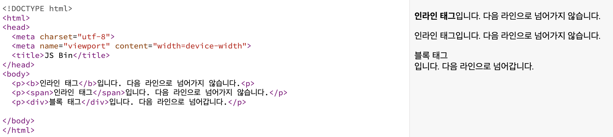

# 목차

- [인라인 요소와 블록 레벨 요소 비교](#인라인-요소와-블록-레벨-요소-비교)

 

# 인라인 요소와 블록 레벨 요소 비교

인라인과 블록 레벨 중 어떤 태그를 사용하는지에 따라서 자동으로 줄 바꿈이 바꿈 여부가 결정된다.

<table>
    <thead>
        <tr>
            <th>구분</th>
            <th>인라인 요소 (Inline elements)</th>
            <th>블록 레벨 요소 (Block-level elements)</th>
        </tr>
    </thead>
    <tbody>
        <tr>
            <td>줄바꿈</td>
            <td>다른 요소와 같은 줄에 배치되며, 앞뒤로 다른 요소가 이어서 나타난다.</td>
            <td>항상 새로운 줄에서 시작하고, 다른 요소가 같은 줄에 나타나지 않는다.</td>
        </tr>
        <tr>
            <td>너비</td>
            <td>요소의 너비는 내용의 길이에 따라 결정되며, 부모 요소의 너비를 차지하지 않는다.</td>
            <td>가능한 한 부모 요소의 전체 너비를 가득 채우려고 확장된다. 즉, 부모 요소의 너비에 따라서 크기가 결정된다.</td>
        </tr>
        <tr>
            <td>사용 목적</td>
            <td>주로 텍스트 내용의 일부분을 스타일링하는 데 사용된다. 강조, 링크 추가, 텍스트 스타일 변경 등의 목적으로 사용된다.</td>
            <td>주로 문서의 큰 구조를 만드는데 사용된다. 섹션, 아티클, 내비게이션 등 큰 구조를 정의하는데 적합하다.</td>
        </tr>
        <tr>
            <td>예시</td>
            <td>&lt;span&gt;, &lt;a&gt;, &lt;strong&gt;, &lt;em&gt;, &lt;img&gt;, &lt;input&gt;, &lt;button&gt;</td>
            <td>&lt;div&gt;, &lt;h1&gt;, &lt;p&gt;, &lt;ul&gt;, &lt;li&gt;, &lt;table&gt;, &lt;form&gt;, &lt;section&gt;</td>
        </tr>
    </tbody>
</table>

