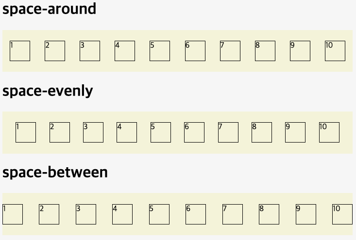
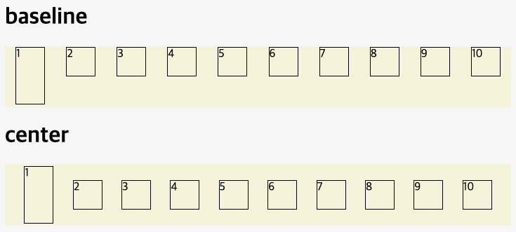
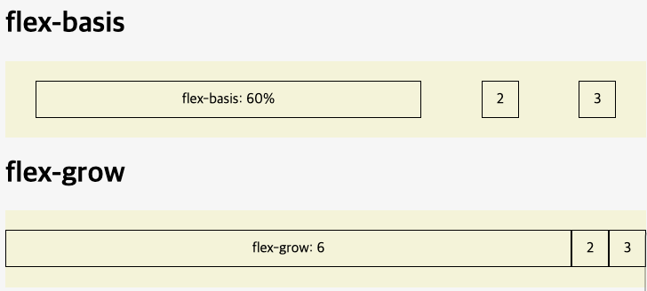
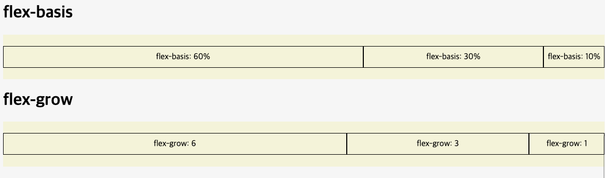

# 목차

- [flex](#flex)
- [flex container 속성](#flex-container-속성)
  - [display](#display)
  - [flex-direction](#flex-direction)
  - [flex-wrap](#flex-wrap)
  - [flex-flow](#flex-flow)
  - [justify-content](#justify-content)
  - [align-content](#align-content)
  - [align-items](#align-items)
- [flex item 속성](#flex-item-속성)
  - [order](#order)
  - [flex-grow](#flex-grow)
  - [flex-shrink](#flex-shrink)
  - [flex-basis](#flex-basis)
  - [flex](#flex)
  - [align-self](#align-self)

<br>

# flex

```html
<div class="container">
  <div class="item">1</div>
  <div class="item">2</div>
  <div class="item">3</div>
</div>
```

```css
.container {
  display: flex;
  background-color: royalblue;
}
.container .item {
  width: 100px;
  height: 100px;
  border: 2px solid red;
  background-color: orange;
}
```

일반적으로 `block` 요소들은 수직으로 쌓이는 성격을 가지고 있다. 만약 수평으로 정렬하고 싶다면 정렬 하려는 요소들의 부모 요소에 `display: flex`를 추가한다.

<br>

# flex container 속성

## `display`

Flex container의 화면 출력 특성이다.

- display: flex;
- display: inline-flex;

flex items와 상관없이 flex container를 block처럼 취급하고 싶다면 `display: flex`를 사용한다. 반대로 flex items와 상관없이 flex container를 inline처럼 취급(너비가 내용의 길이대로 지정)하고 싶다면 `display: inline-flex`를 사용한다.

<br>

## `flex-direction`

Flex items의 배치 방향을 지정한다.

- flex-direction: row(default);
- flex-direction: row-reverse;
- flex-direction: column;
- flex-direction: column-reverse;

flex items를 수평으로 배치하고 싶다면 `flex-direction: row`를 사용한다. 반대로 수직으로 배치하고 싶다면 `flex-direction: column`을 사용한다.

reverse의 경우 `row-reverse`는 수평으로 배치된 flex items의 순서를 반대로 하고, `column-reverse`는 수직으로 배치된 flex items의 순서를 반대로 한다. 즉, `row-reverse`는 flex items의 시작점을 오른쪽으로, `column-reverse`는 flex items의 시작점을 아래쪽으로 배치한다.

<br>

## `flex-wrap`

Flex items의 줄 바꿈을 지정한다.

- flex-wrap: nowrap(default);
- flex-wrap: wrap;
- flex-wrap: wrap-reverse;

flex items를 한 줄에 배치하고 싶다면 `flex-wrap: nowrap`을 사용한다. 반대로 여러 줄에 걸쳐 배치하고 싶다면 `flex-wrap: wrap`을 사용한다.

`wrap-reverse`의 경우 `wrap`과 같이 여러 줄에 걸쳐 배치하지만, flex items의 순서를 반대로 한다.

<br>

## `flex-flow`

Flex items의 배치 방향과 줄 바꿈을 단축하여 지정한다. `flex-direction` 속성과 `flex-wrap` 속성을 단축하여 지정할 수 있다. 기본 값은 row nowrap이며, `flex-direction` 속성 값이 row이고 `flex-wrap` 속성 값이 nowrap인 것과 같다.

- flex-flow: row nowrap(default);

<br>

## `justify-content`

Flex items의 중심축의 정렬 방식을 지정한다.

- justify-content: flex-start(default);
- justify-content: flex-end;
- justify-content: center;
- justify-content: space-between;
- justify-content: space-around;
- justify-content: space-evenly;

`flex-start`는 flex items를 시작점으로 정렬한다. `flex-end`는 flex items를 끝점으로 정렬한다. `center`는 flex items를 가운데로 정렬한다.

`space-between`는 첫 박스와 마지막 박스는 화면 끝에 배치하며, flex items 사이에 동일한 간격을 둔다.

`space-around`는 flex items 주위에 동일한 간격을 둔다. 따라서 첫 박스와 마지막 박스는 간격값이 중첩되지 않기에 간격이 가장 적고, 나머지 가운데 요소들 간격은 더 넓은 간격을 갖는다. 이와 다르게 `space-evenly`는 flex items 주위와 사이에 동일한 간격을 둔다.



<br>

## `align-content`

Flex lines의 교차축 방식을 지정한다. 기본적으로 flex items가 한 줄에 배치되어 있을 때는 적용되지 않는다. 즉, `flex-wrap: wrap`이 적용되어 flex items가 여러 줄에 걸쳐 배치되어 있을 때만 적용되며, flex items가 한 줄에 배치되어 있을 때는 `align-items` 속성이 적용된다.

- align-content: stretch(default);
- align-content: flex-start;
- align-content: flex-end;
- align-content: center;
- align-content: space-between;
- align-content: space-around;
- align-content: space-evenly;

`stretch`는 flex lines를 container의 끝점까지 늘린다. `flex-start`는 flex lines를 시작점으로 정렬한다. `flex-end`는 flex lines를 끝점으로 정렬한다. `center`는 flex lines를 가운데로 정렬한다. `space-between`는 flex lines 사이에 동일한 간격을 둔다. `space-around`는 flex lines 주위에 동일한 간격을 둔다.

<br />

## `align-items`

Flex items의 교차축 정렬 방식을 지정한다. 기본적으로 flex items가 한 줄에 배치되어 있을 때 적용된다. 즉, `flex-wrap: wrap`이 적용되어 flex items가 여러 줄에 걸쳐 배치되어 있을 때는 `align-content` 속성이 적용된다.

- align-items: stretch(default);
- align-items: flex-start;
- align-items: flex-end;
- align-items: center;
- align-items: baseline;

`stretch`는 flex items를 container의 끝점까지 늘린다. `flex-start`는 flex items를 시작점으로 정렬한다. `flex-end`는 flex items를 끝점으로 정렬한다. `center`는 flex items를 가운데로 정렬한다. `baseline`은 flex items를 문자의 기준선(baseline)에 정렬한다.



<br>

# flex item 속성

## `order`

Flex item의 순서를 지정한다. 기본 값은 0이며, 음수를 사용할 수 있다.

- order: 0(default);

`order` 속성을 사용하지 않으면 기본값인 0이 적용되어 flex item의 순서는 HTML의 구조와 동일하다. `order` 속성을 사용하면 flex item의 순서를 변경할 수 있는데 숫자가 작을수록 앞에 배치되며, 숫자가 클수록 뒤에 배치된다.

<br>

## `flex-grow`

Flex item이 플렉스 컨테이너 내에 남는 공간을 어떻게 분할할지 결정한다. 기본 값은 0이며, 음수를 사용할 수 없다.

- flex-grow: 0(default);

`flex-grow` 속성을 사용하지 않으면 기본값인 0이 적용되어 flex item의 너비는 `width` 속성 값에 의해 결정된다. `flex-grow` 속성을 사용하면 flex item의 너비를 `width` 속성 값에 상관없이 flex container의 여유 공간에 맞게 증가시킬 수 있다. `flex-grow` 속성 값이 0이 아닌 flex item은 flex container의 여유 공간을 모두 채우기 위해 flex item의 너비가 증가한다.

<br>

## `flex-shrink`

Flex item의 감소 너비 비율을 지정한다. 기본 값은 1이며, 음수를 사용할 수 없다.

- flex-shrink: 1(default);

`flex-shrink` 속성을 사용하지 않으면 기본값인 1이 적용되어 flex item의 너비는 `width` 속성 값에 의해 결정된다. `flex-shrink` 속성을 사용하면 flex item의 너비를 `width` 속성 값에 상관없이 flex container의 여유 공간에 맞게 감소시킬 수 있다. 즉, flex container 크기가 점점 줄어들면, flex item들의 크기 또한 비율에 맞게 줄어든다. 하지만 이를 원치 않는 경우 `flex-shrink` 속성 값을 1이 아닌 0으로 지정하여 flex container에 맞춰서 flex item의 크기가 줄어들지 않도록 할 수 있다.

<br>

## `flex-basis`

Flex item의 (공간 배분 전) 기본 너비(초기 너비)를 지정한다. 플렉스 컨테이너 내에서 아이템이 차지해야 할 기본 공간의 크기를 지정한다. 기본 값은 auto이며, content 크기와 동일하다. 음수를 사용할 수 없다. `flex-grow`를 사용할 때 해당 content 크기를 제외한 나머지 여유 공간을 flex item들에게 배분한다. `flex-basis`를 사용하면 content 크기를 제외한 나머지 여유 공간을 flex item들에게 배분하기 전에 flex item의 기본 너비를 지정할 수 있다.

- flex-basis: auto(default);




<br>

## `flex`

Flex item의 너비(증가 너비, 감소 너비, 기본 너비)를 지정한다. `flex-grow`, `flex-shrink`, `flex-basis` 속성을 단축하여 지정할 수 있다. 기본 값은 0 1 auto이며, `flex-grow` 속성 값이 0이고 `flex-shrink` 속성 값이 1이며 `flex-basis` 속성 값이 auto인 것과 같다.

- flex: 0 1 auto(default);

<br>

## `align-self`

Flex item의 개별 flex box의 교차축 정렬 방식을 지정하여 컨테이너의 기본 설정 교차축 정렬(`align-items`)와 다르게 지정할 수 있다. 기본 값은 auto이며, `align-items` 속성 값이 적용된다.

- align-self: auto(default);
