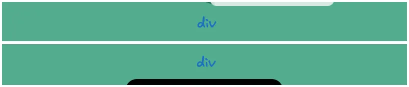
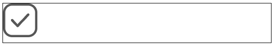
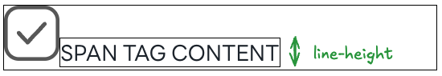
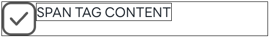
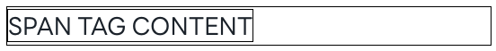
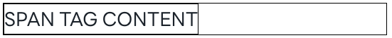

# 목차

- [개요](#개요)
- [원인](#원인)
- [해결](#해결)
  - [`vertical-align: top;`](#1-vertical-align-top)
  - [`display: block;`](#2-display-block)
- [Ref](#ref)

<br />

# 개요



```js
import eventImage from 'assets/images/event';

const Example = () => {
  return (
    <>
      <div>
        
      </div>
      {/* 마치 두 <div>간에 간격이 있는 것처럼 보임 */}
      <div>
        
      </div>
    </div>
  );
};
```

`<div>` 태그에 아무런 CSS를 적용하지 않고, `` 태그만 자식요소로 넣었다. 이 때, `<div>`가 자동으로 설정된 높이(e.g., 1200px)와 ``의 높이(e.g., 1196px)가 다른 문제가 발생했다. `<div>`의 높이가 ``보다 높으니 이미지가 차지하고 남은 나머지 아래 영역은 `<div>`의 배경색이 보여지고 있으며, 브라우저에서는 마치 `<div>`에 `margin`이 적용되어 단차가 있는듯한 느낌을 주었다.

<br />

# 원인

`block`요소는 기본적으로 자식 요소를 포함할 만큼의 높이를 가진다. 너비의 경우 설정하지 않으면 부모 너비를 차지하며, 높이의 경우 자식 요소의 높이에 맞춰 자동으로 조정된다. 반면에 `inline` 요소는 높이를 조정할 수 없다. 내용 크기만큼 차지하며, 높이를 지정하더라도 적용되지 않고 `line-height`에 의해서 조정된다.

<br />

```js
const Example = () => {
  return (
    <div style={{ border: '1px solid black', fontSize: '30px' }}>
      
    </div>
  );
};
```



위 예시를 확인해보면 `block` 태그인 `<div>`의 높이가 자식 요소의 높이보다 크게 설정되어 있음을 확인할 수 있다(`` 의 border 아래에 빈 공간을 확인할 수 있음). 기본적으로 `inline` 요소의 `baseline` 기본값인 `normal`은 하단에 위치하고 있으며, 폰트 자체의 높이 계산을 위하여 예상보다 높게 나타나는 것이다.

<br />

```js
const Example = () => {
  return (
    <div style={{ border: '1px solid black', fontSize: '30px' }}>
      
      <span style={{ border: 1px solid black }}>SPAN TAG CONTENT</span>
    </div>
  );
};
```



`<span>`을 넣어보면 `baseline` 때문임을 더욱 쉽게 확인할 수 있다. `baseline`이 하단에 위치하여 폰트가 들어갈 공간을 확보해 놓고 있는 것이다. 하지만 `<span>` 아래에도 공간이 있는 이유는 폰트 자체에도 값이 있는데 해당 값은 폰트 디자이너가 설정해둔 값이기 때문에 우리가 제어하기는 어렵다.

<br />

# 해결

## 1. `vertical-align: top;`

폰트가 아닌 이미지의 경우 ``의 정렬 기준인 `baseline`을 `top`으로 변경하면 여백이 제거됨을 확인할 수 있다.

```js
const Example = () => {
  return (
    <div style={{ border: '1px solid black', fontSize: '30px' }}>
      
      <span style={{ border: '1px solid black' }}>SPAN TAG CONTENT</span>
    </div>
  );
};
```



이미지의 `baseline`을 `vertical-align: top`으로 변경하니 위와 같이 `<div>`와 ``의 높이가 일치됨을 확인할 수 있다. 하지만 폰트를 담고 있는 `<span>`의 경우 여전히 위, 아래로 여백이 존재하고 있다.

<br />



이미지 태그를 제거하고 `<span>`만 남겼을 때, 이미지의 경우에만 `block`태그와 `inline` 태그의 높이를 일치시킬 수 있음을 확인할 수 있다.

<br />

## 2. `display: block;`, `display: inline-block;`

가장 간단한 방법 중 하나로 `inline` 요소를 레이아웃 흐름을 자체적으로 차지하는 박스 컨테이너인 `block`요소 혹은 `inline-block`으로 변경하여 `baseline`에 영향을 받지 않도록 하면 된다.

```js
const Example = () => {
  return (
    <div style={{ border: '1px solid black', fontSize: '30px' }}>
      <span style={{ display: 'inline-block', border: '1px solid black' }}>SPAN TAG CONTENT</span>
    </div>
  );
};
```



<br />

# Ref

- [(번역) CSS에 대한 깊은 이해: 폰트 매트릭스, line-height와 vertical-align](https://wit.nts-corp.com/2017/09/25/4903?utm_source=chatgpt.com)
- [CSS - line-height 총 정리](https://m.blog.naver.com/weekamp/222040583269?utm_source=chatgpt.com)
